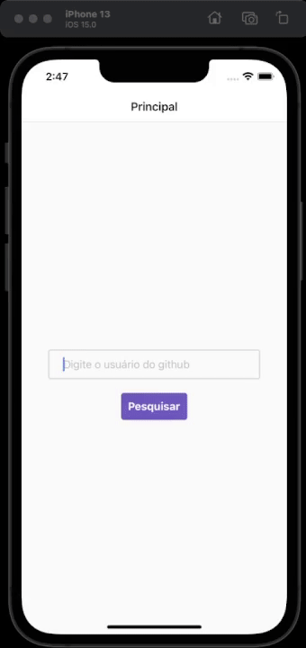

<h1 align="center">
    
</h1>

<h4 align="center"> 
	Ficando Online 
</h4>

<p align="center">
  <a href="#information_source-o-que-é-o-ficando-online">O que é o Ficando Online?</a>&nbsp;&nbsp;&nbsp;|&nbsp;&nbsp;&nbsp;
  <a href="#rocket-Tecnologias">Tecnologias</a>&nbsp;&nbsp;&nbsp;|&nbsp;&nbsp;&nbsp;
  <a href="#information_source-como-usar">Como usar</a>&nbsp;&nbsp;&nbsp;|&nbsp;&nbsp;&nbsp;
</p>

## :information_source: O que é o Ficando Online?

O ficando online é uma aplicação feita em React Native consumindo uma API externa, no caso a API publica do Github. Esse projeto é utilizado no curso 4 da formação inicial de React Native da plataforma da Alura.


<h1 align="center">
    
</h1>


## :rocket: Tecnologias

Esse projeto foi desenvolvido usando as seguintes tecnologias:
- [React Native][rn]
- [Expo][expo]

## :information_source: Como usar

Para copiar e executar essa aplicação você precisa do [Git](https://git-scm.com), [Node.js][nodejs] + [Yarn][yarn] intalados no seu computador.

No terminal digite:

### Instalar Mobile

```bash
# Clonar esse repositório
$ git clone https://github.com/andreocunha/ficando-online.git

# Vá para o ropositório
$ cd projeto-online

# Instale as dependências
$ npm install

# Execute
$ expo start

```

Feito por André Oliveira Cunha :wave: [Linkedin](https://www.linkedin.com/in/andr%C3%A9-oliveira-cunha-b26b3a156/)

[nodejs]: https://nodejs.org/
[expo]: https://expo.io/
[rn]: https://facebook.github.io/react-native/
[yarn]: https://yarnpkg.com/
